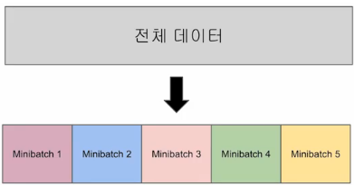
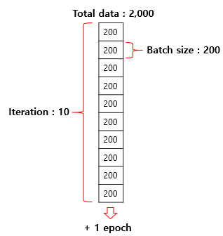

# 미니 배치와 데이터 로더

## 1. 미니 배치와 배치 크기(Mini Batch and Batch Size)

```
x_train = torch.FloatTensor([[73, 80, 75],
                             [93, 88, 93],
                             [89, 91, 90],
                             [96, 98, 100],
                             [73, 66, 70]])
y_train = torch.FloatTensor([[152], [185], [180], [196], [142]])
```

- 위 데이터의 샘플의 개수는 5개
- 전체 데이터를 하나의 행렬로 선언하여 전체 데이터에 대해서 경사 하강법을 수행하여 학습할 수 있음
- But, 만약 데이터가 수십만개 이상이라면 전체 데이터에 대해서 경사 하강법을 수행하는 것은 매우 느릴 뿐만 아니라 많은 계산량 필요!
- ⇒ 전체 데이터를 더 작은 단위로 나누어서 해당 단위로 학습하는 개념 등장 ⇒ 미니 배치(Mini Batch)
    
    
    
    - 미니 배치만큼 가져가서 미니 배치에 대한 비용(cost)을 계산하고, 경사 하강법 수행
    - 다음 미니 배치를 가져가서 경사 하강법 수행… 이를 마지막 미니 배치까지 반복
    - 전체 데이터에 대한 학습이 1회 끝나면 1epoch가 끝남
    - 배치 크기: 미니 배치의 개수는 미니 배치의 크기를 몇으로 하냐에 따라 달라짐. 이때 미니 배치의 크기를 의미함

- 배치 경사 하강법: 전체 데이터에 대해서 한 번에 경사 하강법 수행
    - 전체 데이터를 사용하므로 가중치 값이 최적값에 수렴하는 과정이 매우 안정적이지만 계산량이 매우 큼
- 미니 배치 경사 하강법: 미니 배치 단위로 경사 하강법 수행
    - 전체 데이터의 일부만을 보고 수행하므로 최적값으로 수렴하는 과정에서 값이 조금 헤매기도 하지만 훈련 속도 빠름
- 배치 크기는 보통 2의 제곱수 사용
    - ex) 2, 4, 8, 16, 32, 64…
    - CPU와 GPU의 메모리가 2의 배수이므로 배치크기가 2의 제곱수일 경우에 데이터 송수신의 효율을 높일 수 있음’

## 2. 이터레이션(Iteration)



- 이터레이션(Iteration): 한 번의 epoch 내에서 이루어지는 매개변수인 가중치 W와 b의 업데이트 횟수
- 전체 데이터가 2,000일 때 배치 크기를 200으로 하면 이터레이션의 수는 총 10개 ⇒ 한 epoch당 매개변수 업데이트가 10번 발생