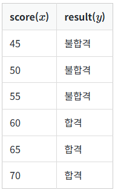

# 로지스틱 회귀(Logistic Regression)

## 1. 이진 분류(Binary Classification)

- 학생들이 시험 성적에 따라서 합격, 불합격이 기재된 데이터가 있다고 가정
    - 시험 성적이  x라면, 합불 결과는 y
    - 해당 시험의 커트라인은 공개되지 않았으나, 데이터로부터 특정 점수를 얻었을 때의 합격, 불합격 여부를 판정하는 모델을 만들고자 함
        
        
        
        
        
    - x와 y의 관계를 표현하기 위해서는 직선이 아닌 S자 형태로 표현할 수 있는 함수 필요
        - ⇒ 시그모이드 함수

## 2. 시그모이드 함수(Sigmoid Function)

- W값의 변화에 따른 경사도 변화
    
    
    
    - 빨간색 선: W의 값이 0.5일 때
    - 초록색 선: W의 값이 1일 때
    - 파란색 선: W의 값이 2일 때
    - W가 커지면 경사가 커지고, W의 값이 작아지면 경사가 작아짐

- b값의 변화에 따른 좌, 우 이동
    
    
    
    - 빨간색 선: b의 값이 0.5일 때
    - 초록색 선: b의 값이 1일 때
    - 파란색 선: b의 값이 1.5일 때

- 시그모이드 함수를 이용한 분류
    - 시그모이드 함수의 출력값은 0과 1사이
    - 임계값을 0.5라고 가정 => 출력값이 0.5 이상이면 1(true), 이하면 0(false)로 판단할 수 있음

## 3. 비용 함수(Cost function)

- 로지스틱 회귀의 가설인 H(x) = sigmoid(Wx + b)를 선형 회귀에서 사용한 비용함수인 평균 제곱 오차를 사용하게 된다면?
    
    
    
    - 위의 식을 미분하면 아래 형태와 같은 심한 비볼록(non-convex) 그래프가 그려짐
    
    
    
    - 위의 그래프에서 경사하강법을 적용하면, 로컬 미니멈에 도착했을 때 가장 최솟값에 도달했다고 착각할 수 있음
- 시그모이드 함수의 특징은 출력값이 0과 1사이
    - 실제값이 1일 때 예측값이 0에 가까워지면 오차가 커져야 함
    - 실제값이 0일 때 예측값이 1에 가까워지면 오차가 커져야함
    - ⇒ 이를 만족하는 함수는 로그함수
    
    
    
    - 주황색 선: 실제값이 1일 때
    - 초록색 선: 실제값이 0일 때
    - cost: 오차, H(x): 예측
- cost 계산
    
    
    
    
    
    
    
    