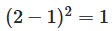
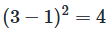

# 원-핫 인코딩(One-Hot Encoding)

## 1. 원-핫 인코딩(One-Hot Encoding)이란?

- 선택해야하는 선택지의 개수만큼의 차원을 가지면서, 각 선택지의 인덱스에 해당하는 원소에는 1, 나머지 원소는 0의 값을 가지도록 하는 표현 방법
    - ex) 강아지, 고양이, 냉장고라는 3개의 선택지가 있다고 가정
        - 각 선택지에 순차적으로 정수 인덱스 부여
        - 강아지는 0번 인덱스, 고양이는 1번 인덱스, 냉장고는 2번 인덱스 부여
        - 강아지=[1, 0, 0], 고양이=[0, 1, 0], 냉장고=[0, 0, 1]

## 2. 원-핫 벡터의 무작위성

- 반드시 실제값을 원-핫 벡터로 표현해야만 다중 클래스 분류 문제를 풀 수 있는 것은 아니나, 대부분의 다중 클래스 분류 문제가 각 클래스 간의 관계가 균등하다는 점에서 원-핫 벡터는 이러한 점을 표현할 수 있는 적절한 표현 방법
- 다수의 클래스를 분류하는 문제에서는 이진 분류처럼 2개의 숫자 레이블이 아니라 클래스 개수만큼 숫자 레이블 필요
    - 이 때, 직관적으로 생각해볼 수 있는 방법은 클래스 전체에 정수 인코딩
    ex) 분류해야할 레이블: {red, green, blue} ⇒ 1, 2, 3
    - 위의 경우, MSE(평균 제곱 오차)를 계산하면 실제값이 green일 때 예측값이 red였다면 오차는
        
        
        
    - 실제값이 blue일때 예측값이 red였다면 오차는
        
        
        
    - 즉, red가 blue보다는 green에 더 가깝다는 의미를 담게됨 ⇒ 일반적인 분류문제에서 각 클래스는 순서의 의미를 갖고 있지 않으므로 각 클래스간의 오차는 균등해야함. 따라서 위의 인코딩 방식은 일반적인 분류문제에 적절하지 않음