# 소프트맥스 회귀(Softmax Regression) 이해하기

## 1. 다중 클래스 분류(Multi-class Classification)

- 이진 분류가 2개의 답 중 하나를 고르는 문제였다면, 3개 이상의 답 중 하나를 고르는 문제를 다중 클래스 분류라고 함
    - ex) 아래의 문제는 꽃받침 길이, 꽃받침 넓이, 꽃잎 길이, 꽃잎 넓이라는 4개의 특성(feature)로부터 setosa, versicolor, virginica라는 3개의 붓꽃 품종 중 어떤 품종인지를 예측하는 문제로 전형적인 다중 클래스 분류 문제임
        
        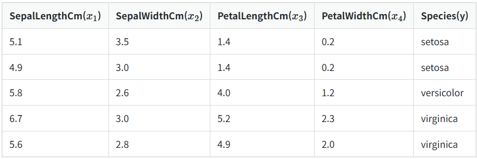
        
    
- 로지스틱 회귀
    - 로지스틱 회귀에서 시그모이드 함수는 예측값을 0과 1사이의 값으로 만듦
    - 스팸 메일 분류기를 로지스틱 회귀로 구현하였을 때, 출력이 0.75라면 이는 이메일이 스팸일 확률이 75%라는 의미 <=> 스팸이 아닐 확률은 25%
        
        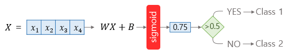
        
- 소프트맥스 회귀
    - 소프트맥스 회귀는 확률의 총 합이 1이 되는 이 아이디어를 다중 클래스 분류에 적용
    - 각 클래스마다 소수 확률을 할당 ⇒ 이 때 총 확률의 합은 1이어야함
        
        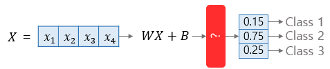
        

## 2. 소프트맥스 함수(Softmax Function)

- 소프트맥스 함수의 이해
    - k차원의 벡터에서 i번째 원소를 Zi, i번째 클래스가 정답일 확률을 Pi로 나타낸다고 했을 때 소프트맥스 함수는 Pi를 다음과 같이 정의
        
        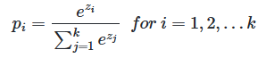
        
    - 위의 붓꽃 품질 예측문제의 경우에는 k(차원)=3이므로 3차원 벡터 Z = [Z1, Z2, Z3]의 입력을 받으면 소프트 맥스 함수는 아래와 같은 출력을 리턴
        
        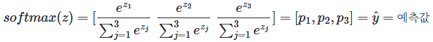
        
    - P1, P2, P3 각각은 1번, 2번, 3번 클래스가 정답일 확률을 나타내면 0과 1사이의 값 ⇒ 총 합은 1
    - 여기서 분류하고자 하는 3개의 클래스는 주어진 입력이 virginica일 확률, setosa일 확률, versicolor일 확률을 나타내는 값을 의미
        
        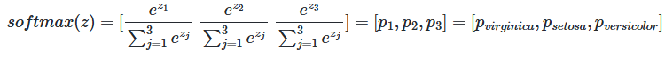
        
- 그림을 통한 이해
    
    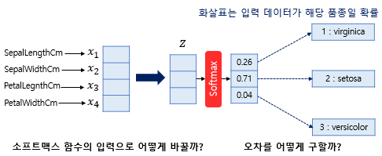
    
    - 샘플 데이터를 1개씩 입력으로 받아 처리한다고 가정 ⇒ 배치 크기: 1
    - 하나의 샘플 데이터는 4개의 독립 변수 x를 가지는데 이는 모델이 4차원 벡터를 입력으로 받음
    - 소프트맥스의 함수의 입력으로 사용되는 벡터는 벡터의 차원이 분류하고자 하는 클래스의 개수가 되어야함 ⇒ 어떤 가중치 연산을 통해 3차원 벡터로 변환
    
    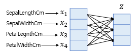
    
    - 소프트맥스 함수의 입력 벡터 z의 차원수만큼 결과값이 나오도록 가중치 곱을 진행
    - 위의 화살표는 총 12개이며, 전부 다른 가중치를 가지고 학습 과정에서 점차적으로 오차를 최소화하는 가중치로 값이 변경됨
    - 예측값과 비교를 할 수 있는 실제값의 표현 방법이 있어야함 ⇒ 소프트맥스 회귀에서는 실제값을 원-핫 벡터로 표현
    
    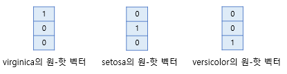
    
    - 각 실제값의 정수 인코딩은 1, 2, 3이 되고 원-핫 인코딩을 수행하여 실제값을 원-핫 벡터로 수치화한 것을 보여줌
    
    
    
    - ex) 현재 풀고 있는 샘플 데이터의 실제값이 setosa라면 setosa의 원-핫 벡터는 [0 1 0] ⇒ 예측값과 실제값의 오차가 0이 되는 경우는 소프트맥스 함수의 결과가 [0 1 0]이 되는 경우 ⇒ 두 벡터의 오차를 계산하기 위해 소프트맥스 회귀는 비용 함수로 크로스 엔트로피 함수를 사용
    
    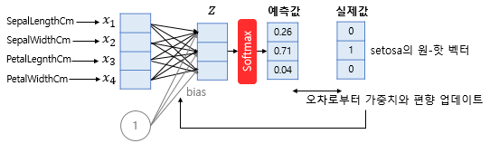
    
    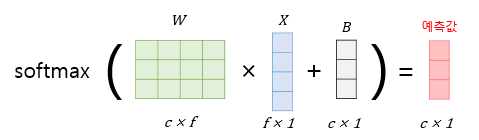
    
    - 입력의 특성의 수만큼의 차원을 가진 입력 벡터 x라고 하고, 가중치 행렬을 W, 편향을 b라고할 때 소프트맥스 회귀에서 예측값을 구하는 과정을 나타낸것임. f는 특성의 수, c는 클래스의 개수

## 3. **붓꽃 품종 분류하기 행렬 연산으로 이해하기**

- 위의 예제 데이터는 전체 샘플의 개수가 5개, 특성이 4개이므로 5 x 4 행렬 X로 정의
    
    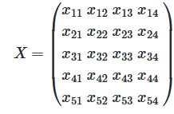
    
- 선택지가 총 3개인 문제 ⇒ 예측값 행렬 Y의 열의 개수는 3개. 그리고 각 행은 행렬 X의 예측값이므로 행의 크기는 동일 ⇒ 행렬 Y의 행의 개수는 5개
    
    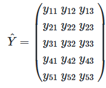
    
- 편향 행렬 B는 예측값 행렬 Y와 크기가 동일 ⇒ 5 X 3의 크기를 가짐
    
    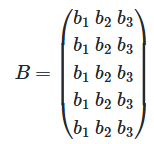
    
- 결론은 다음과 같음\
    
    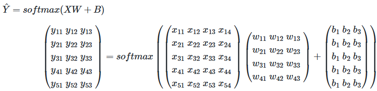
    

## 4. 비용 함수(Cost Function)

- 크로스 엔트로피 함수
    - 아래에서 y는 실제값을 나타내며, k는 클래스의 개수로 정의. Yj는 실제값 원-핫 벡터의 j번째 인덱스를 의미, Pj는 샘플 데이터가 j번째 클래스일 확률을 나타냄
        
        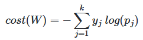
        
    - c가 실제값 원-핫 벡터에서 1을 가진 원소의 인덱스라고 한다면, Pc = 1은 예측값이 실제값을 정확하게 예측한 경우 ⇒ 크로스 엔트로피 함수의 값은 0
        
        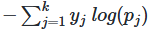
        
        - 위의 값을 최소화하는 방향으로 학습해야함!
    - 이를 n개의 전체 데이터에 대한 평균을 구한다고 하면 최종 비용 함수는 다음과 같음
        
        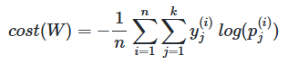
        
- 이진 분류에서의 크로스 엔트로피 함수
    - 로지스틱 회귀의 크로스 엔트로피 함수식으로부터 소프트맥스 회귀의 크로스 엔트로피 함수식 도출
        
        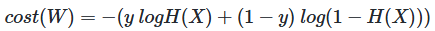
        
    - 위의 식에서 y를 y1, 1 - y를 y2로 치환하고 H(x)를 p1, 1 - H(x)를 p2로 치환
        
        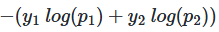
        
    - 이 식은 아래와 같이 표현 가능
        
        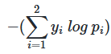
        
    - 소프트맥스 회귀에서는 k의 값이 고정된 값이 아니므로 2를 k로 변경
        
        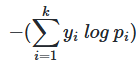
        
    - 위의 식은 결과적으로 소프트맥스 회귀의 식과 동일 ⇒ 역으로 소프트맥스 회귀에서 로지스틱 회귀의 크로스 엔트로피 함수식을 얻는 것은 k를 2로 하고, y1과 y2를 각각 y와 1 - y로 치환하고, p1와 p2를 각각 H(x)와 1 - H(x)로 치환
    - 즉, 소프트맥스 함수의 최종 비용 함수에서 k가 2라고 가정하면 로지스틱 회귀의 비용 함수와 동일
        
        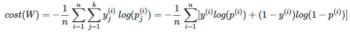