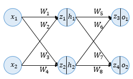

# 역전파(BackPropagation)

## 1. 인공 신경망의 이해(Neural Network Overview)

- 입력층, 은닉층, 출력층 총 3개의 층으로 구성된 인공 신경망
- 두 개의 입력, 두 개의 은닉층 뉴런, 두개의 출력층 뉴런 사용
- z: 이전층의 모든 입력이 각각의 가중치와 곱해진 값들이 모두 더해진 가중합
- h, o: 시그모이드 함수를 지난 후의 값으로 각 뉴런의 출력값
- W: 가중치

## 2. 순전파(Forward Propagation)

1. 입력값 z1, z2 계산
    - z1 = W1x1 + W2x2 = 0.3 * 0.1 + 0.25 * 0.2 = 0.08
    - z2 = W3x1 + W4x2 = 0.4 * 0.1 + 0.35 * 0.2 = 0.11
- 출력값 h1, h2 계산
    - h1 = sigmoid(z1) = 0.51998934
    - h2 = sigmoid(z2) = 0.52747230
- 입력값 z3, z4 계산
    - z3 = W5h1 + W6h2 = 0.45 * h1 + 0.4 * h2 = 0.44498412
    - z4 = W7h1 + W8h2 = 0.7 * h1 + 0.6 * h2 = 0.68047592
- 출력값 o1, o2 계산
    - o1 = sigmoid(z3) = 0.60944600
    - o2 = sigmoid(z4) = 0.66384491
- 오차 계산(MSE 사용)
    - target: 실제값(정답), output: 예측값
    
    
    

## 3. 역전파 1단계(BackPropagation Step 1)

- 출력층 바로 이전의 은닉층을 N층이라고 했을 때, 출력층과 N층 사이의 가중치를 업데이트하는 단계를 역전파 1단계, N층과 N층의 이전층 사이의 가중치를 업데이트 하는 단계를 역전파 2단계라고 가정
    
    
    
    - 1단계에서 업데이트할 가중치는 W5, W6, W7, W8
    - 가중치 W5를 업데이트하기 위해 $\frac{\partial E_{total}}{\partial w_5}$값 계산
    - 미분의 연쇄 법칙(Chain rule)에 따라 다음과 같이 풀어쓸 수 있음
        
        
        
        
        
        
        
        
        
    - o1은 시그모이드 함수의 출력값 ⇒ 시그모이드 함수 미분 ⇒ $f(x)*(1-f(x))$
        
        
        
        - sigmoid(z3)를 z3로 미분
        
        
        
        
        
        - z3 = W5h1 + W6h2 이므로 W5로 미분하면 h1만 남음
        
        
        
    - 학습률을 0.5라고 가정
        
        
        
    - 위와 같은 원리로 다음과 같이 계산
        
        
        

## 4. 역전파 2단계(BackPropagation Step 2)

- 가중치 W5를 업데이트하기 위해 $\frac{\partial E_{total}}{\partial w_1}$값 계산
    
    
    
- $\frac{\partial E_{total}}{\partial h_1}$는 다음과 같이 쓸 수 있음
    
    
    
- $\frac{\partial E_{o1}}{\partial h_1}$를 다음과 같이 분해 및 계산
    
    
    
    
    
- 위와 같은 원리로 $\frac{\partial E_{o2}}{\partial h_1}$계산
    
    
    
- 나머지 두 항도 다음과 같이 계산
    
    
    
    
    
- $\frac{\partial E_{total}}{\partial h_1}$는 다음과 같음
    
    
    
- W1 가중치를 업데이트
    
    
    
- W2, W3, W4 계산
    
    
    

## 5. 결과 확인

- 오차가 감소했는지 확인
    
    
    
- 순전파 오차: 0.02397190 > 역전파 오차: 0.02323634
    - 오차가 줄어듦