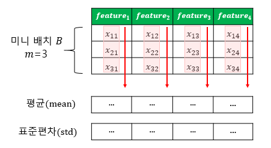

# 기울기 소실(Gradient Vanishing) 폭주(Exploding)

- 기울기 소실
    - 역전파 과정에서 입력층으로 갈수록 기울기(Gradient)가 점차적으로 작아지는 현상
- 기울기 폭주
    - 기울기가 점차 커지더니 가중치들이 비정상적으로 큰 값이 되면서 발산

## 1. ReLU와 ReLU의 변형

- 시그모이드 함수를 사용하면 입력의 절대값이 클 경우, 시그모이드 함수의 출력값이 0 또는 1에 수렴하면서 기울기가 0에 가까워짐 
⇒ 역전파 과정에서 전파 시킬 기울기가 점차 사라져서 입력층 방향으로 갈수록 제대로 역전파가 되지 않는 기울기 소실 문제 발생
- 기울기 소실을 완화하는 간단한 방법은 은닉층의 활성화 함수로 ReLU나 ReLU의 변형함수와 같은 Leaky ReLU를 사용
    - 은닉층에서 시그모이드 함수 사용 x
    - Leaky ReLU를 사용하면 모든 입력값에 대해서 기울기가 0에 수렴하지 않아 죽은 ReLU 문제 해결
    - 은닉층에서 ReLU나 Leaky ReLU와 같은 ReLU 함수의 변형 사용

## 2. 가중치 초기화(Weight initialization)

- 세이비어 초기화(Xavier Initialization) 또는 글로럿 초기화(Glorot Initialization)
    - 균등 분포(Uniform Distribution) 또는 정규 분포(Normal distribution)로 초기화 할 때 두 가지 경우로 나뉘며, 이전 층의 뉴런 개수와 다음 층의 뉴런 개수를 가지고 식을 세움
        - $n_{in}$: 이전 층의 뉴런 개수
        - $n_{out}$: 다음 층의 뉴런의 개수
    - 균등 분포를 사용하여 가중치를 초기화할 경우 다음과 같은 균등 분포 범위 사용
        - $W \sim \mathrm{Uniform}\left(-\sqrt{\frac{6}{n_{in}+n_{out}}},\; +\sqrt{\frac{6}{n_{in}+n_{out}}}\right)$
        - $\sqrt{\frac{6}{n_{in}+n_{out}}}$을 m이라고 하였을 때, -m과 +m 사이의 균등 분포를 의미
    - 정규 분포로 초기화할 경우, 평균은 0, 표준 편차 $\sigma$가 다음을 만족하도록 함
        - $\sigma = \sqrt{\frac{2}{n_{in} + n_{out}}}$
    - 세이비어 초기화는 여러 층의 기울기 분산 사이에 균형을 맞춰서 특정 층이 너무 주목을 받거나 다른 층이 뒤쳐지는 것을 방지
    - 시그모이드 함수나 하이퍼볼릭 탄젠트 함수와 같은 S자 형태인 활성화 함수와 함께 사용하는 경우 좋은 성능을 보이나, ReLU와 함께 사용할 경우 성능 좋지 않음
- He 초기화(He initialization)
    - 세이비어 초기화와 유사하게 정규 분포와 균등 분포 두 가지 경우로 나뉨
        - 세이비어 초기화와 다른 점은 He 초기화는 다음 층의 뉴런의 수를 반영하지 않음
        - $n_{in}$: 이전 층의 뉴런 개수
    - 균등 분포로 초기화 할 경우 다음과 같은 균등 분포 범위를 가지도록 함
        - $W \sim \mathrm{Uniform}\left(-\sqrt{\frac{6}{n_{in}}},\; +\sqrt{\frac{6}{n_{in}}}\right)$
    - 정규 분포로 초기화할 경우, 표준 편차 $\sigma$가 다음을 만족하도록 함
        - $\sigma = \sqrt{\frac{2}{n_{in}}}$
    - ReLU 계열 함수를 사용할 경우에는 He 초기화 방법이 효율적이며, ReLU + He 초기화 방법이 좀 더 보편적

## 3. 배치 정규화(Batch Normalization)

- 인공 신경망의 각 층에 들어가는 입력을 평균과 분산으로 정규화하여 학습을 효율적으로 만듦
- 내부 공변량 변화(Internal Covariate Shift)
    - 학습 과정에서 층 별로 입력 데이터 분포가 달라지는 현상
    - 이전 층들의 학습에 의해 이전 층의 가중치 값이 바뀌게 되면, 현재 층에 전달 되는 입력 데이터의 분포가 현재 층이 학습했던 시점의 분포와 차이가 발생
    - 공변량 변화는 훈련 데이터의 분포와 테스트 데이터의 분포가 다른 경우를 의미
    - 내부 공변량 변화는 신경망 층 사이에서 발생하는 입력 데이터의 분포 변화를 의미
- 배치 정규화(Batch Normalization)
    - 한 번에 들어오는 배치 단위로 정규화
    - 각 층에서 활성화 함수를 통과하기 전에 수행
    - 입력에 대해 평균을 0으로 만들고, 정규화 진행
    - 정규화 된 데이터에 대해서 스케일과 시프트 수행
        - 두 개의 매개변수 $\gamma$와 $\beta$를 사용하는데, $\gamma$는 스케일을 위해 사용하고, $\beta$는 시프트를 하는 것에 사용하며 다음 레이어에 일정한 범위의 값들만 전달
    - 배치 정규화 수식은 다음과 같음(BN은 배치 정규화를 의미)
        - Input: $B = \{x^{(1)}, x^{(2)}, \dots, x^{(m)}\}$
        - Output: $y^{(i)} = \mathrm{BN}_{\gamma,\beta}(x^{(i)})$
        - $u_B = \frac{1}{m} \sum_{i=1}^{m} x^{(i)}$ # 미니 배치에 대한 평균
        - $\sigma_B^2 = \frac{1}{m} \sum_{i=1}^{m} \left(x^{(i)} - \mu_B\right)^2$ # 미니 배치에 대한 분산
        - $\hat{x}^{(i)} = \frac{x^{(i)} - \mu_B}{\sqrt{\sigma_B^2 + \varepsilon}}$ # 정규화
        - $y^{(i)} = \gamma \hat{x}^{(i)} + \beta
        = \mathrm{BN}_{\gamma,\beta}(x^{(i)})$ # 스케일 조정과 시프트
            - m은 미니 배치에 있는 샘플의 수
            - $u_B$는 미니 배치 B에 대한 평균
            - $\sigma_B$는 미니 배치 B에 대한 표준편차
            - $\hat{x}^{(i)}$은 평균이 0이고 정규화 된 입력 데이터
            - $\varepsilon$는 분모가 0이 되는 것을 막는 작은 수. 보편적으로 $10^{-5}$
            - $\gamma$는 정규화 된 데이터에 대한 스케일 매개변수로 학습 대상
            - $\beta$는 정규화 된 데이터에 대한 시프트 매개변수로 학습 대상
            - $y^{(i)}$는 스케일과 시프트를 통해 조정한 BN의 최종 결과
    - 배치 정규화는 학습 시 배치 단위의 평균과 분산들을 차례대로 받아 이동 평균과 이동 분산을 저장해놓았다가 테스트 할 때는 해당 배치의 평균과 분산을 구하지 않고 구해놓았던 평균과 분산으로 정규화
    - 배치 정규화를 사용하면 시그모이드 함수나 하이퍼볼릭탄젠트 함수를 사용하더라도 기울기 소실 문제가 크게 개선
    - 가중치 초기화에 훨씬 덜 민감
    - 훨씬 큰 학습률을 사용할 수 있어 학습 속도를 개선
    - 미니 배치마다 평균과 표준편차를 계산하므로 훈련 데이터에 일종의 잡음을 넣는 부수 효과로 과적합을 방지하는 효과 ⇒ 부수적 효과이므로 드롭 아웃과 함께 사용하는 것이 좋음
    - 배치 정규화는 모델을 복잡하게 만들며, 추가 계산을 하는 것이므로 테스트 데이터에 대한 예측 시 실행 시간 느림 ⇒ 서비스 속도를 고려하는 관점에서는 배치 정규화가 꼭 필요한 지 고민 필요
- 배치 정규화의 한계
    - 미니 배치 크기에 의존적
        - 너무 작은 배치 크기에서 잘 동작하지 않을 수 있음
            - 단적으로 배치 크기를 1로 하게되면 분산은 0
        - 작은 미니 배치에서는 배치 정규화의 효과가 극단적으로 작용되어 훈련에 악영향
    - RNN에 적용하기 어려움
        - RNN은 각 시점(time step)마다 다른 통계치를 가짐 ⇒ 배치 정규화 적용 어려움
        - 배치 크기에도 의존적이지 않으며, RNN에도 적용하는 것이 수월한 층 정규화(layer normalization)방법이 있음

## 4. 층 정규화(Layer Normalization)

- 다음은 m이 3이고, 특성의 수가 4일 때의 배치 정규화
    
    
    
- 같은 조건의 층 정규화
    
    