# 머신 러닝 기본 개념 정리

## 1. 머신 러닝 모델의 평가

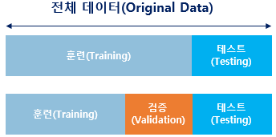

- 실제 모델을 평가하기 위해서 데이터를 훈련용, 검증용, 테스트용 3가지로 분리하는 것이 일반적
- 검증용 데이터는 모델의 성능을 조정하기 위한 용도
    - 과적합이 있는지 판단하거나 하이퍼파라미터의 조정을 위한 용도
    - 하이퍼파라미터: 값에 따라서 모델의 성능에 영향을 주는 매개변수
        - 하이퍼파라미터는 사용자가 직접 정할 수 있음
            - ex) 학습률, 은닉층의 수, 뉴런의 수, 드롭아웃 비율 등
    - 매개변수: 가중치와 편향과 같이 학습을 통해 바뀌는 변수
- 훈련용 데이터로 훈련을 모두 시킨 모델은 검증용 데이터를 사용하여 정확도를 검증하며 하이퍼파라미터를 튜닝

## 2. 분류(Classification)와 회귀(Regression)

- 이진 분류 문제(Binary Classification)
    - 주어진 입력에 대해서 둘 중 하나의 답을 정하는 문제
    - ex) 시험 성적에 대해서 합격, 불합격인지 판단하고 메일로부터 정상 메일, 스팸 메일인지 판단
- 다중 클래스 분류(Multi-class Classification)
    - 주어진 입력에 대해서 세 개 이상의 정해진 선택지 중에서 답을 정하는 문제
    - ex) 새 책이 입고되었을 때 해당 책이 어떤 카테고리 또는 범주에 속하는지 판단
- 회귀 문제(Regression)
    - 분류 문제처럼 0 도는 1이나 과학 책장, IT 책장 등과 같이 분리된(비연속적인) 답이 결과가 아니라 연속된 값을 결과로 가짐
    - ex) 시험 성적 예측 시, 5시간 공부하였을 때 80점, 5시간 1분 공부하였을 때 80.5점, 7시간 공부하였을 때 90점 등이 나옴
    - 그 이외에도 시계열 데이터를 이용한 주가 예측, 생산량 예측, 지수 예측 등이 속함

## 3. 지도 학습(Supervised Learning)과 비지도 학습(Unsupervised Learning)

- 지도 학습
    - 레이블(Label)이라는 정답과 함께 학습’
    - 레이블이라는 말 외에도 y, 실제값 등으로 부르기도 함
- 비지도 학습
    - 목적 데이터(또는 레이블)이 없는 학습
    - 군집(clustering)이나 차원 축소와 같은 학습 방법
- 강화 학습
    - 어떤 환경 내에서 정의된 에이전트가 현재의 상태를 인식하며, 선택 가능한 행동들 중 보상을 최대화하는 행동 혹은 순서를 선택하는 방법

## 4. 샘플(Sample)과 특성(Feature)

- 독립 변수 x의 행렬을 X라고 하였을 때, 독립 변수의 개수가 n개이고 데이터의 개수가 m인 행렬 X는 다음과 같음
    
    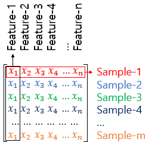
    
    - 머신 러닝에서 하나의 데이터, 하나의 행을 샘플(Sample)이라고 부름
    - 종속 변수 y를 예측하기 위한 각각의 독립 변수 x를 특성(Feature)라고 부름

## 5. 혼동 행렬(Confusion Matrix)

- 머신 러닝에서 맞춘 문제수를 전체 문제수로 나눈 값을 정확도(Accuracy)라고 함
- 정확도는 맞춘 결과와 틀린 결과에 대한 세부적인 내용을 알려주지 않음 ⇒ 이를 위해 혼동 행렬 사용
    - ex) 양성(Positive)과 음성(Negative)를 구분하는 이진 분류가 있다고 가정하면 혼동 행렬은 다음과 같음
        
        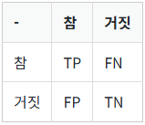
        
        - True: 정답을 맞춘 경우
        - False: 정답을 맞추지 못한 경우
        - Positive: 정답을 양성이라고 제시
        - Negative: 정답을 음성이라고 제시
        - TP: 정답을 양성이라고 제시하였고, 실제로 정답을 맞춘 경우
        - TN: 정답을 음성이라고 제시하였고, 실제로 정답을 맞춘 경우
        - FP: 정답을 양성이라고 제시하였으나, 실제 정답은 음성이라서 틀린 경우
        - FN: 정답을 음성이라고 제시하였으나, 실제 정답은 양성이라서 틀린 경우
- 정밀도(Precision)
    - 양성이라고 대답한 전체 케이스에 대한 TP의 비율
        
        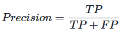
        
- 재현률(Recall)
    - 실제값이 양성인 데이터의 전체 개수에 대해서 TP의 비율
    - 양성인 데이터 중에서 얼마나 양성인지를 예측(재현)했는지 나타냄
        
        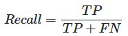
        

## 6. 과적합(Overfitting)과 과소 적합(Underfitting)

- 과적합: 훈련 데이터를 과하게 학습하여 테스트 데이터나 실제 서비스에서의 데이터에 대해서 정확도가 좋지 않은 현상
    - ex) 강아지 사진과 고양이 사진을 구분하는 기계가 있을 때, 검은색 강아지 사진 훈련 데이터를 과하게 학습하면 기계는 흰색 강아지나, 갈색 강아지를 보고도 강아지가 아니라고 판단할 수 있음
    - 과적합을 방지하기 위해 테스트 데이터의 오차가 증가하기 전이나, 정확도가 감소하기 전에 훈련을 멈추는 것이 바람직
- 과소적합: 테스트 데이터의 성능이 올라갈 여지가 있음에도 훈련을 덜 한 상태
    - 과적합과는 달리 훈련 데이터에 대해서도 정확도가 낮음

## 7. 비선형 활성화 함수(Activation Function)

- 입력을 받아 수학적 변환을 수행하고 출력을 생성하는 함수
    - ex) 시그모이드 함수, 소프트맥스 함수
- 활성화 함수의 특징 - 비선형 함수(Nonlinear Function)
    - 활성화 함수는 선형 함수가 아닌 비선형 함수여야 함
        - 비선형 함수: 직선 1개로 그릴 수 없는 함수
    - 인공 신경망의 능력을 높이기 위해서 은닉층을 계속 추가해야함
        - 선형 함수를 사용하게 되면 은닉층을 쌓을 수 없음
        - 활성화 함수를 `f(x) = Wx` 라고 가정하면, 은닉층을 2개 추가한다고 했을 때 출력층을 포함해서 y(x) = f(f(f(x)))가 됨 ⇒ W * W * W * x
        - ⇒ W의 세 제곱을 k라고 정의하면, y(x) = kx와 같이 표현 가능
        - 즉, 선형 함수로는 은닉층을 여러번 추가해도 1회 추가한 것과 차이를 줄 수 없음
    - 선형 함수를 사용한 은닉층을 1번 추가한 것과 연속으로 사용한 것의 차이가 없다는 것이지, 선형 함수를 사용한 층이 아무런 의미가 없진 않음 ⇒ 학습 가능한 가중치가 새로 생긴다는 점에서 의미 있음
        - 선형 함수를 사용한 층을 활성화 함수를 사용하는 은닉층과 구분하기 위해 선형층(linear layer)나 투사층(projection layer) 등의 다른 표현을 사용하기도 함
- 시그모이드 함수(Sigmoid Function)와 기울기 소실
    - 시그모이드 함수를 사용한 어떤 인공 신경망이 있다고 가정
        
        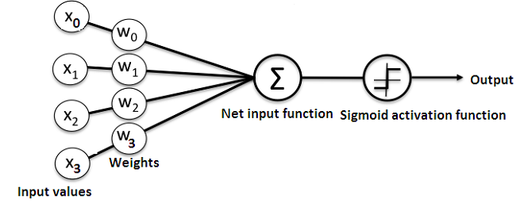
        
        - 인공 신경망은 입력에 대해서 순전파(forward propagation) 연산 진행
        - 순전파 연산을 통해 나온 예측값과 실제값의 오차를 손실 함수(loss function)을 통해 계산
        - 손실(loss)를 미분을 통해서 기울기(gradient)를 구하고, 이를 통해 역전파(back propagation) 수행
    - 시그모이드 함수의 문제점은 미분을 해서 기울기(gradient)를 구할 때 발생
        
        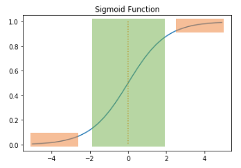
        
        - 시그모이드 함수의 출력값이 0 또는 1에 가까워지면, 그래프의 기울기가 완만(0에 가까워짐)
        - 기울기 소실(Vanishing Gradient): 역전파 과정에서 0에 아주 가까운 아주 작은 기울기가 곱해지면 앞단에는 기울기가 잘 전달되지 않음
        - 시그모이드 함수를 사용하는 은닉층의 개수가 다수가 될 경우에는 0에 가까운 기울기가 계속 곱해지면 앞단에서는 거의 기울기를 전파받을 수 없음 ⇒ 매개변수 W가 업데이트 되지 않아 학습이 되지 않음
        - 시그모이드 함수를 은닉층에서 사용하는 것은 지양
- 하이퍼볼릭탄젠트 함수(Hyperbolic tangent function)
    
    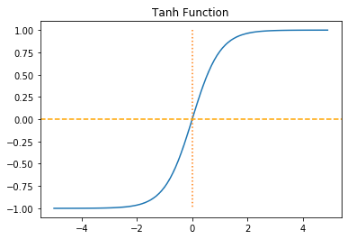
    
    - 함수(tanh) 입력값을 -1과 1사이의 값으로 변환
    - 하이퍼볼릭탄젠트 함수도 -1과 1에 가까운 출력값을 출력할 때, 시그모이드 함수와 같은 문제 발생
    - 시그모이드 함수(0 ~ 1)와 달리 출력값이 0을 중심으로 하고 있어 반환값의 변화폭이 큼 ⇒ 시그모이드 함수보다 기울기 소실 증상이 적은 편
- 렐루 함수(ReLU) f(x) = max(0, x)
    
    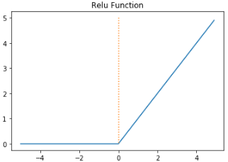
    
    - 음수를 입력하면 0을 출력하고, 양수를 입력하면 입력값을 그대로 반환
    - 특정 양수값에 수렴하지 않으므로 깊은 신경망에서 시그모이드 함수보다 훨씬 더 잘 작동
    - 시그모이드 함수나 하이퍼볼릭탄젠트 함수와 같이 어떤 연산이 필요한 것이 아니라 단순 임계값이므로 연산 속도도 빠름
    - 죽은 렐루(dying ReLU)입력값이 음수면 기울기 0 ⇒ 해당 뉴런을 다시 회생하는 것은 매우 어려움
- 리키 렐루(Leaky ReLU) f(x) = max(ax, x)
    
    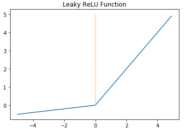
    
    - 입력값이 음수일 경우에 0이 아니라 0.001과 같은 매우 작은 수를 반환
    - a는 하이퍼파라미터로 Leaky(’새는’) 정도를 결정하며 일반적으로 0.01의 값을 가짐
- 소프트맥스 함수(Softmax Function)
    
    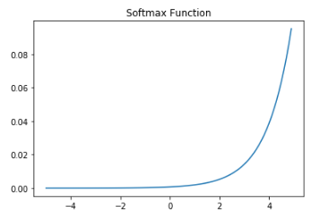
    
    - 시그모이드 함수처럼 출력층의 뉴런에서 주로 사용
    - 시그모이드 함수가 두 가지 선택지 중 하나를 고르는 이진 분류 (Binary Classification) 문제에 사용된다면 세 가지 이상의 (상호 배타적인) 선택지 중 하나를 고르는 다중 클래스 분류(MultiClass Classification) 문제에 주로 사용
- 편향 이동(bias shift)
    - 시그모이드 함수는 원점 중심이 아니고, 평균이 0.5이기 때문에 항상 양수를 출력 ⇒ 출력의 가중치 합이 입력의 가중치 합보다 커질 가능성 높음
    - 각 레이어를 지날 때마다 분산이 계속 커져 가장 높은 레이어서는 활성화 함수의 출력이 0이나 1로 수렴하게 되어 기울기 소실 문제 발생