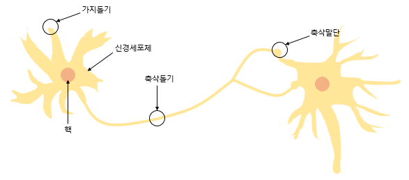

# 퍼셉트론(Perceptron)

## 1. 퍼셉트론

- 프랑크 로젠블라트(Frank Rosenblatt)가 1957년에 제안한 초기 형태의 인공 신경망으로 **다수의 입력으로부터 하나의 결과를 내보내는 알고리즘**

- x는 입력값을 의미하며, W는 가중치, y는 출력값을 의미
- 그림 안의 원은 인공 뉴런에 해당
- 각각의 인공 뉴런에서 보내진 입력값 x는 각각의 가중치 W와 함께 종착지인 인공 뉴런에 전달
    - 가중치의 값이 클수록 해당 입력 값이 중요하다는 것을 의미

- 각 입력값이 가중치와 곱해져서 인공 뉴런에 전달되고, 각 입력값과 그에 해당하는 가중치의 곱의 전체 합이 임계치(threshold)를 넘으면 인공 뉴런은 출력 신호로서 1을 출력, 그렇지 않으면 0을 출력
    - 이러한 함수를 **계단 함수**라고 부름

- 계단 함수에 사용된 임계치값을 보통 세타(Θ)로 표현

## 2. 단층 퍼셉트론(Single-Layer Perceptron)

- 값을 보내는 단계와 값을 받아서 출력하는 두 단계로 이루어짐
    - 각 단계를 층(layer)라고 부르며, 값을 입력받는 단계를 입력층(input layer), 보내는 단계를 출력층(output layer)라고 부름
    
    
    

## 3. 다층 퍼셉트론(MultiLayer Perceptron, MLP)

- 단층 퍼셉트론은 입력층과 출력층만 존재한다면, 다층 퍼셉트론은 중간에 층을 더 추가한 형태
    - 입력층과 출력층의 중간에 위치하는 층을 **은닉층(hidden layer)**이라고 부름
    
    
    
    - 위의 그림은 AND, NAND, OR 게이트를 조합하여 XOR 게이트를 구현한 다층 퍼셉트론의 예
- 다층 퍼셉트론의 은닉층은 1개 이상일 수 있음 ⇒ 2개, 3개 … n개
    
    
    
    - 위와 같이 은닉층이 2개 이상인 신경망을 **심층 신경망(Deep Neural Network, DNN)**이라고 부름
    - **딥러닝(Deep Learning)**: 심층 신경망을 학습