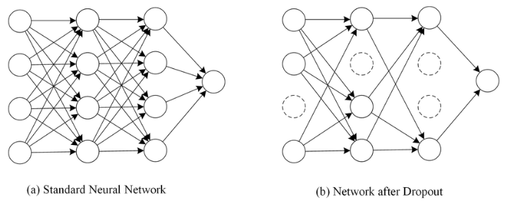

# 과적합(Overfitting)을 막는 방법들

- 학습 데이터에 모델이 과적합되면 학습 데이터에 대한 정확도는 높아도, 검증 데이터나 테스트 데이터에 대해서는 제대로 동작하지 않음
⇒ 모델이 학습 데이터를 불필요할정도로 과하게 암기하여 훈련 데이터에 포함된 노이즈까지 학습한 상태라고 해석할 수 있음

## 1. 데이터의 양을 늘리기

- 모델은 데이터의 양이 적을 경우, 해당 데이터의 특정 패턴이나 노이즈까지 쉽게 암기하게 되므로 과적합 현상 발생활 확률 늘어남 ⇒ 데이터의 양을 늘릴 수록 모델은 데이터의 일반적인 패턴을 학습하여 과적합 방지할 수 있음
- 데이터의 양이 적을 경우, 의도적으로 기존의 데이터를 조금씩 변형하고 추가하여 데이터의 양을 늘림
⇒ 데이터 증식 또는 증강(Data Augmentation)이라고 함

## 2. 모델의 복잡도 줄이기

- 인공 신경망의 복잡도는 은닉층(hidden layer)의 수나 매개변수의 수 등으로 결정
⇒ 과적합 현상이 포착되면, 인공 신경망의 복잡도 줄이기
- 다음과 같은 인공 신경망이 있다고 가정
    
    ```python
    class Architecture1(nn.Module):
    	def __init__(self, input_size, hidden_size, num_classes):
    		super(Architecture1, self).__init__()
    		self.fc1 = nn.Linear(input_size, hidden_size)
    		self.relu = nn.ReLU()
    		self.fc2 = nn.Linear(hidden_size, hidden_size)
    		self.relu = nn.ReLU()
    		self.fc3 = nn.Linear(hidden_size, num_classes)
    	
    	def forward(self, x):
    		out = self.fc1(x)
    		out = self.relu(out)
    		out = self.fc2(out)
    		out = self.relu(out)
    		out = self.fc3(out)
    		return out
    ```
    
    - 위 인공 신경망은 3개의 선형 레이어(Layer)를 가지고 있음. 위의 모델이 과적합을 보인다면 다음과 같이 인공 신경망의 복잡도를 줄일 수 있음
    
    ```python
    class Architecture1(nn.Module):
    	def __init__(self, input_size, hidden_size, num_classes):
    		super(Architecture1, self).__init__()
    		self.fc1 = nn.Linear(input_size, hidden_size)
    		self.relu = nn.ReLU()
    		self.fc2 = nn.Linear(hidden_size, hidden_size)
    	
    	def forward(self, x):
    		out = self.fc1(x)
    		out = self.relu(out)
    		out = self.fc2(out)
    		return out
    ```
    
    - 위 인공 신경망은 2개의 선형 레이어(Linear)를 가지고 있음
    - 인공 신경망에서는 모델에 있는 매개변수들의 수를 모델의 **수용력(capacity)**이라고 하기도 함

## 3. 가중치 규제(Regularization) 적용하기

- 복잡한 모델을 좀 더 간단하게 하는 방법으로 가중치 규제(Regularization)이 있음
    - L1 규제:  가중치 w들의 절대값 합계를 비용 함수에 추가 ⇒ L1 노름
        - L1 규제는 기존의 비용 함수에 모든 가중치에 대해서 $\lambda \lvert w \rvert$를 더한 값을 비용 함수로 함
    - L2 규제: 모든 가중치 w들의 제곱합을 비용 함수에 추가 ⇒ L2 노름
        - L2 규제는 기존의 비용 함수에 모든 가중치에 대해서 $\frac{1}{2}\lambda w^2$를 더한 값을 비용함수로 함
    - $\lambda$: 규제의 강도를 정하는 하이퍼파라미터.
    $\lambda$가 크다면 모델이 훈련 데이터에 대해서 적합한 매개 변수를 찾는 것보다 규제를 위해 추가된 항들을 작게 유지하는 것을 우선한다는 의미
    - 위의 두 식 모두 비용 함수르 최소화하기 위해서는 가중치 w들의 값이 작아져야 함
        - ex) L1 규제를 사용하면 비용 함수가 최소가 되게 하는 가중치와 편향을 찾는 동시에 가중치들의 절대값의 합도 최소가 되어야 함 ⇒ 가중치 w의 값들은 0 또는 0에 가까이 작아져야 하므로 어떤 특성들은 모델을 만들 때 거의 사용하지 않게됨
        - H(x) = w1x1 + w2x2 + w3x3 + w4x4라는 수식이 있다고 가정
            - L1 규제를 사용하였더니, w3의 값이 0이 됨 ⇒ x3 특성은 모델의 결과에 별 영향을 주지 못하는 특성임을 의미
    - L2 규제는 L1 규제와는 달리 제곱을 최소화하므로 w의 값이 완전히 0이 되는 것이 아닌 0에 가까워짐
- L1 규제는 어떤 특성들이 모델에 영향을 주고 있는지 정확히 판단하고자 할 때 유용
- L1 규제를 통해 어떤 특성이 모델에 영향을 주고 있는지 판단할 필요가 없다면 L2 규제 사용 권장
    - 인공신경망에서 L2 규제는 가중치 감쇠(weight decay)라고도 함

## 4. 드롭아웃(Dropout)

- 드롭아웃은 학습 과정에서 신경망의 일부를 사용하지 않는 방법
    - ex) 드롭아웃의 비율을 0.5로 한다면 학습 과정마다 랜덤으로 절반의 뉴런을 사용하지 않고, 절반의 뉴런만을 사용
        
        
        
    - 드롭아웃은 신경망 학습 시에만 사용하고, 예측 시에는 사용하지 않는 것이 일반적
    - 인공 신경망이 특정 뉴런 또는 특정 조합에 너무 의존적이게 되는 것을 방지해주고, 매번 랜덤 선택으로 뉴런들을 사용하지 않으므로 서로 다른 신경망들을 앙상블하여 사용하는 것 같은 효과를 내어 과적합 방지