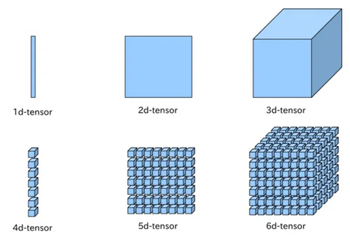

# 텐서 조작하기

출처: [https://wikidocs.net/52460](https://wikidocs.net/52460)

## 1. 벡터, 행렬 그리고 텐서(Vector, Matrix and Tensor)

1. 벡터, 행렬, 텐서 그림으로 이해하기
    
    
    

- 벡터(Vector or 1d-tensor): 1차원으로 구성된 값
- 행렬(Matrix or 2d-tensor): 2차원으로 구성된 값

## 2. PyTorch Tensor Shape Convention

- 딥러닝을 할 때 다루고 있는 행렬 또는 텐서의 크기를 고려하는 것은 매우 중요
    
    
    
- 행의 크기: batch size
- 열의 크기: dim
- ex)
훈련 데이터 하나의 크기: 256 (=dim, ex: [3, 1, 2, 5, …] 이러한 숫자들의 나열이 256의 길이로 존재)
훈련 데이터 개수: 3000
전체 훈련 데이터 크기: 3000 * 256 ⇒ 2d-tensor
컴퓨터가 한 번 처리할 데이터의 개수: 64개 (=batch size)
컴퓨터가 한 번 처리할 데이터(2d-tensor)의 크기: 64 * 256
컴퓨터가 전체 훈련 데이터를 학습하기 위해 몇 번을 학습해야하는가? 3000 / 64 = 46.875
⇒ 47번의 학습이 필요!


- NLP 분야의 3D 텐서 예제로 이해하기
    - 아래와 같이 4개의 문장으로 구성된 전체 훈련 데이터가 있다고 가정
        
        ```
        [[나는 사과를 좋아해], [나는 바나나를 좋아해], [나는 사과를 싫어해], [나는 바나나를 싫어해]]
        ```
        
    
    - 컴퓨터는 아직 이 상태로는 '나는 사과를 좋아해'가 단어가 1개인지 3개인지 이해하지 못함.
    ⇒ 컴퓨터의 입력으로 사용하기 위해서는 단어별로 나눠주어야 함
        
        ```
        [['나는', '사과를', '좋아해'], ['나는', '바나나를', '좋아해'], ['나는', '사과를', '싫어해'], ['나는', '바나나를', '싫어해']]
        ```
        
    
    - 훈련 데이터의 크기는 4 × 3의 크기를 가지는 2D 텐서임
    각 단어를 아래와 같이 3차원의 벡터로 변환
        
        ```
        '나는' = [0.1, 0.2, 0.9]
        '사과를' = [0.3, 0.5, 0.1]
        '바나나를' = [0.3, 0.5, 0.2]
        '좋아해' = [0.7, 0.6, 0.5]
        '싫어해' = [0.5, 0.6, 0.7]
        ```
        
    - 훈련 데이터 재구성
        
        ```
        [[[0.1, 0.2, 0.9], [0.3, 0.5, 0.1], [0.7, 0.6, 0.5]],
         [[0.1, 0.2, 0.9], [0.3, 0.5, 0.2], [0.7, 0.6, 0.5]],
         [[0.1, 0.2, 0.9], [0.3, 0.5, 0.1], [0.5, 0.6, 0.7]],
         [[0.1, 0.2, 0.9], [0.3, 0.5, 0.2], [0.5, 0.6, 0.7]]]
        ```
        
    
    - 이제 훈련 데이터는 4 × 3 × 3의 크기를 가지는 3D 텐서
    batch size를 2로 설정
        
        ```
        첫번째 배치 #1
        [[[0.1, 0.2, 0.9], [0.3, 0.5, 0.1], [0.7, 0.6, 0.5]],
         [[0.1, 0.2, 0.9], [0.3, 0.5, 0.2], [0.7, 0.6, 0.5]]]
        
        두번째 배치 #2
        [[[0.1, 0.2, 0.9], [0.3, 0.5, 0.1], [0.5, 0.6, 0.7]],
         [[0.1, 0.2, 0.9], [0.3, 0.5, 0.2], [0.5, 0.6, 0.7]]]
        ```
        
    
    - 컴퓨터는 배치 단위로 가져가서 연산을 수행.
    현재 각 배치의 텐서의 크기는 (2 × 3 × 3) ⇒ (batch size,  문장 길이, 단어 벡터의 차원)